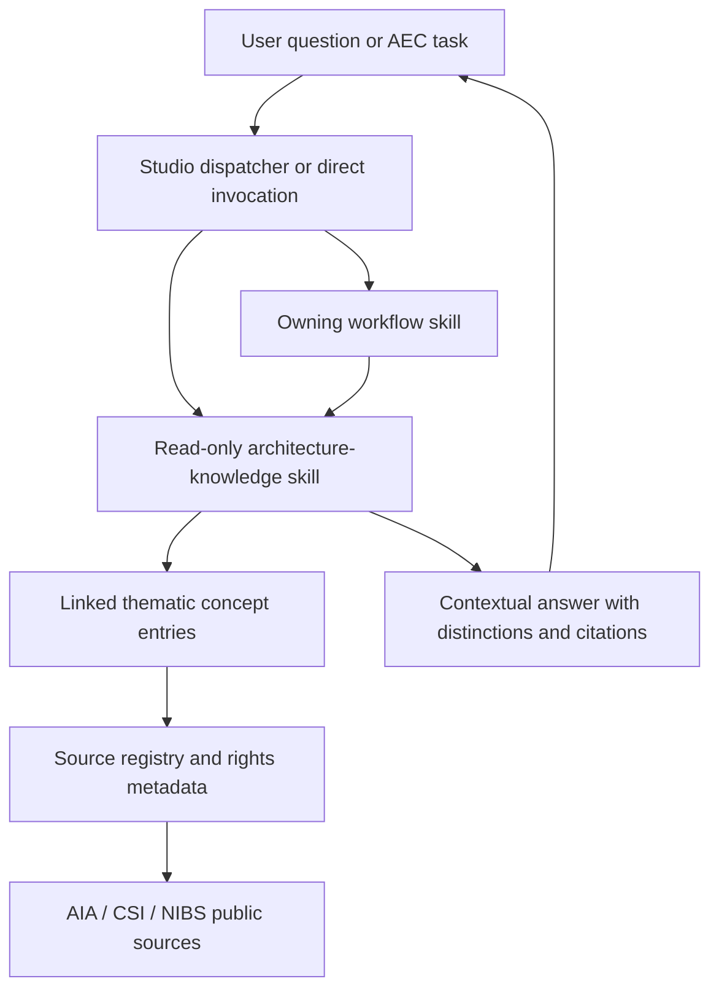

# US Architecture Knowledge Layer - Plan

## Goal Capsule

- **Objective:** Give Arch Studio a source-backed US professional-practice vocabulary for phases, deliverables, roles, delivery methods, AIA contract relationships, and documentation standards.
- **Authority:** The user-confirmed scope governs product behavior. Public first-party AIA, CSI, and NIBS sources govern bundled factual claims. Project agreements and firm standards govern actual project obligations.
- **Execution profile:** Standard cross-cutting plugin feature with source-contract coverage before content and routing changes.
- **Stop conditions:** Stop rather than bundle a claim when no public authoritative source supports it, the rights boundary is unclear, or implementation would overwrite unrelated local 1.4.4 work.
- **Tail ownership:** Complete local verification and report the resulting release impact. Do not commit, push, merge, or publish without separate direction.

---

## Product Contract

### Summary

Arch Studio will ship a read-only `architecture-knowledge` skill backed by a compact linked Markdown reference corpus. It will answer foundational US architecture questions such as “What is a CD set?”, distinguish commonly confused terms, and provide source links without reproducing AIA contracts or licensed standards.

### Problem Frame

The plugin currently has a short, uncited terminology rule and isolated domain knowledge inside individual skills. It knows common abbreviations such as SD, DD, CD, and CA only incidentally. It has no shared model of how a phase relates to a deliverable, role, delivery method, or contract family. This makes ordinary professional language easy to answer inconsistently and makes terms such as “Construction Documents,” “Contract Documents,” and “50% CDs” especially prone to false precision.

### Requirements

#### Knowledge coverage

- R1. Ship a bundled US professional-practice baseline covering project phases, deliverables and issue milestones, participants and roles, common delivery methods, AIA contract series and family relationships, and selected CSI/NIBS documentation terminology.
- R2. Represent each concept with a stable ID, canonical term, aliases, authority class, concise meaning, typed relationships, boundaries, and assertion-level source IDs; aliases with multiple matches require disambiguation.
- R3. Treat “CD set” as common shorthand related to the Construction Documents phase, not as a universal fixed-content package or a synonym for Contract Documents.
- R4. Distinguish AIA-defined or AIA-described terminology from industry shorthand, firm conventions, client milestones, and project-specific contractual requirements.
- R5. Cover a curated core of common AIA relationships rather than attempting to reproduce or summarize the complete AIA Contract Documents catalog.

#### Sources and rights

- R6. Support every bundled factual assertion and relationship with a public first-party source record containing publisher, title, canonical URL, terms or license URL, document identifier or edition when applicable, publication or revision date when available, source status, access/review date, permitted-use note, and rights classification.
- R7. Store original editorial summaries, identifiers, relationship metadata, and links only; do not store contract text, excerpts, clause mappings, licensed standards tables, or reconstructed templates.
- R8. When a claim cannot be supported from an approved public source, disclose the gap instead of filling it from model memory.
- R9. Keep bundled knowledge separate from user-owned studio `standards/` and `references/`; project agreements and user-supplied licensed sources may inform a task but do not become bundled corpus content.

#### Behavior and integration

- R10. Make the lookup skill usable from Codex and Claude without a studio or project and without creating or modifying files.
- R11. Answer with the direct meaning first, then material distinctions and qualifications, followed by clickable sources and source dates or editions.
- R12. Route foundational practice-language questions through `studio`, while keeping specification generation, agreement scope checks, AEC work planning, and regulatory analysis with their existing owning skills.
- R13. Let relevant skills consult the shared knowledge for terminology only; consultation cannot classify scope, authorize work, select a contract, determine deliverable completeness, or modify records.
- R14. Keep the knowledge advisory and contextual; it must not enforce project phases, deliverable completeness, contract selection, project status, or user behavior.
- R15. Reconcile the plugin's conflicting MasterFormat edition claims by preserving the spec-writer's existing limited 2020 mapping as a disclosed compatibility baseline, aligning the formatting rule to that baseline, and separately recording CSI 2026 as current at corpus review without declaring it applicable to every project or adding licensed numbers and titles.

#### Packaging and maintenance

- R16. Document the lookup command in both harness syntaxes and include it in the dispatcher and tooling catalogs.
- R17. Add structural, routing, host-parity, source-integrity, alias-ambiguity, and copyright-boundary coverage, plus auditable human editorial review metadata for every bundled assertion and relationship.
- R18. Update inventory assertions, context metrics, version metadata, changelog, and release documentation against the final integration tree rather than assuming whether the Austin zoning contribution has landed.

### Key Flows

- F1. **Direct terminology lookup**
  - **Trigger:** A user asks what a US architecture term means.
  - **Steps:** The skill resolves aliases, reads the relevant concept and source entries, leads with a concise answer, distinguishes adjacent terms, and cites official sources.
  - **Outcome:** The user receives a verifiable explanation without a workspace mutation.
  - **Covered by:** R1-R4, R6-R11, R14.
- F2. **Embedded terminology inside owned work**
  - **Trigger:** An AEC work plan, proposal, agreement discussion, or specification task contains a phase, contract, or documentation term.
  - **Steps:** The owning skill consults or hands off to the shared reference for meaning, then continues its own workflow without transferring record ownership or treating the reference as workflow authority.
  - **Outcome:** Terms are consistent while the original skill remains responsible for the task.
  - **Covered by:** R12-R15.
- F3. **Unsupported or rights-limited request**
  - **Trigger:** A user requests contract wording, a clause interpretation, a complete standards table, or a conclusion unsupported by public sources.
  - **Steps:** The skill states the boundary, gives only high-level context supported by the corpus, links the authoritative source, and directs project-specific interpretation to the governing document or qualified reviewer.
  - **Outcome:** The plugin remains helpful without republishing or inventing protected material.
  - **Covered by:** R6-R9, R11, R14-R15.

### Acceptance Examples

- AE1. **What is a CD set?** Given that question, the answer identifies CD as Construction Documents in this context, explains that the set commonly includes coordinated drawings and related specifications for pricing, permitting, or construction, and states that exact contents and completion milestones depend on the agreement and project.
- AE2. **Construction Documents versus Contract Documents.** Given that comparison, the answer explains that the design-phase deliverables are not automatically identical to the legally defined Contract Documents and points the user to the governing owner-contractor agreement and conditions.
- AE3. **Is 50% CD an AIA phase?** The answer identifies it as a common firm, client, or project milestone within Construction Documents rather than a universal B101 phase.
- AE4. **Which AIA contract should I sign?** The answer may explain public family relationships and document purposes but does not select a form, interpret a clause, or give legal advice.
- AE5. **What is MasterFormat?** The answer describes its role as a CSI classification system, cites the current public overview, states the referenced version or review date, and does not reproduce the number-and-title list.
- AE6. **Plan a 50% CD submission.** `studio` routes the task to `workplan`; the work-plan skill may use the knowledge layer to clarify the milestone but remains the owner of the plan.

### Scope Boundaries

#### Included

- A national US professional-practice baseline.
- AIA-grounded phases, common deliverables, roles, delivery methods, contract series/families, and high-level relationships.
- CSI and NIBS concepts needed to explain how construction information is organized.
- Source provenance, edition awareness, relationship semantics, and cross-harness lookup.

#### Deferred to Follow-Up Work

- Additional professional organizations and deeper subject ontologies after the core source and maintenance pattern proves useful.
- Automated source-link monitoring or scheduled corpus refreshes.
- Machine export to RDF, JSON-LD, or another formal ontology format.

#### Outside This Product's Identity

- Reproduction of AIA contracts, AIA website content, MasterFormat tables, NCS modules, or other licensed publications.
- Clause interpretation, contract selection, legal advice, code compliance, or jurisdiction-specific rules.
- Firm procedures, standard details, drawing standards, or project obligations that belong in studio `standards/`, studio `references/`, or governing project documents.

### Sources and Research

- [AIA, “Defining the architect's basic services”](https://www.aia.org/resource-center/defining-the-architects-basic-services) supports common phase and deliverable orientation, including the public description of a CD set.
- [AIA Contract Documents, B101-2017 summary](https://help.aiacontracts.com/hc/en-us/articles/1500010280541-Summary-B101-2017-Standard-Form-of-Agreement-Between-Owner-and-Architect) supports the five Basic Services phases and the B101-to-A201 relationship.
- [AIA Contract Documents, A201-2017 summary](https://help.aiacontracts.com/hc/en-us/articles/1500010259162-Summary-A201-2017-General-Conditions-of-the-Contract-for-Construction) supports high-level Conventional-family roles and relationships.
- [AIA Contract Documents, document synopses by family](https://help.aiacontracts.com/list-document-synopses-by-family) supports public document-purpose and family metadata without requiring contract text.
- [AIA and AGC, “A primer on project delivery terms”](https://www.aia.org/resource-center/primer-project-delivery-terms) supports design-bid-build, CM@R, and design-build distinctions.
- [AIA website terms of use](https://www.aia.org/terms-use) establishes the conservative no-republication boundary for AIA site content.
- [CSI Standards overview](https://www.csiresources.org/standards/overview) supports high-level MasterFormat, UniFormat, OmniClass, SectionFormat/PageFormat, and current-edition metadata.
- [CSI MasterFormat FAQ](https://www.csiresources.org/standards/masterformat/mf-faqs) establishes the licensing boundary for MasterFormat content and derivative resources.
- [NIBS, United States National CAD Standard](https://nibs.org/projects/united-states-national-cad-standard-ncs) supports NCS purpose, current version metadata, component relationships, and licensing status.

---

## Planning Contract

### Key Technical Decisions

- KTD1. **Use a thematic linked Markdown corpus.** Store stable concept entries in a small set of vocabulary files plus a source registry. Tests validate every concept ID, alias target, relationship target, and source reference. Do not add a database, parser service, RDF stack, or generated documentation pipeline.
- KTD2. **Give one read-only skill corpus ownership.** `skills/architecture-knowledge/` owns the bundled entries and lookup behavior. Other skills cite or consult that corpus instead of copying definitions.
- KTD3. **Make the rights boundary structural and claim-specific.** Each factual assertion and relationship cites its source and rights metadata. The corpus schema has no fields for full text, excerpts, clauses, clause crosswalks, or standards tables. Automated checks enforce the structure; an identified human reviewer records review evidence for every summary because a test cannot prove that prose is a safe paraphrase.
- KTD4. **Keep behavior contextual, not deterministic.** (session-settled: user-directed — chosen over software enforcement: Arch Studio is intended to stay fluid and relies on users to manage their work responsibly.) The skill explains the national baseline and qualifications but never decides whether a project phase, submission, or contract action is allowed.
- KTD5. **Separate authority classes.** Every concept identifies whether it is supported by an AIA/CSI/NIBS source, is common industry shorthand, or is project/firm-specific. An alias never silently inherits stronger authority than its source supports.
- KTD6. **Start with a curated core.** Cover B101 and A201 as anchors, the common A/B/C/G series purposes, their principal relationship edges, and the common delivery methods. Do not enumerate the complete AIA forms library.
- KTD7. **Use explicit authority precedence.** For a contextual task, the governing project agreement controls first, then confirmed firm standards, then the bundled national baseline, then industry shorthand. The lookup skill explains this order but never interprets the governing agreement.
- KTD8. **Treat CSI as edition-aware licensed context.** The corpus records MasterFormat 2026 as current at the review date but contains no number/title database. For compatibility, the current spec-writer retains its limited 2020 mapping, the formatting rule names the same basis, and generated specifications disclose that basis and require verification against the project's licensed edition. SectionFormat's three-part organization remains a separate concept and is not assigned a MasterFormat edition.
- KTD9. **Preserve one-way skill ownership.** `studio` routes general terminology to the lookup skill. `workplan`, `agreement`, and `spec-writer` may consult the corpus for foundational context. `architecture-knowledge` never invokes those skills, reads their project records, or returns workflow authority.
- KTD10. **Keep one semantic owner.** `skills/architecture-knowledge/` owns factual definitions and source records. `rules/terminology.md` remains style and first-use guidance and links to the corpus rather than duplicating phase, role, contract, or documentation definitions.
- KTD11. **Derive release inventory at integration time.** The open Austin contribution changes the expected skill/agent totals if it lands first. Tests and audit metrics must reflect the actual final tree, not a count embedded in this plan.

### High-Level Technical Design



The knowledge layer reads bundled files only. It does not resolve or mutate a studio or project. An owning workflow may use its answer as context, but no records or actions flow back through the knowledge skill.

### Output Structure

```text
skills/architecture-knowledge/
├── SKILL.md
├── README.md
└── references/
    ├── README.md
    ├── sources.md
    ├── phases-and-deliverables.md
    ├── roles-and-delivery.md
    ├── contract-families.md
    └── documentation-standards.md
```

Each vocabulary file uses the schema owned by `references/README.md`. Stable IDs and relationship edges live with the relevant concept and carry their own source references. `sources.md` owns source, lifecycle, edition, rights, permitted-use, and editorial-review metadata.

### Implementation Constraints

- Preserve the current uncommitted 1.4.4 workspace and commercial-record changes. Several required catalog and dispatcher files are already modified.
- Do not copy text from research pages into the corpus. Write original concise summaries after reviewing the source.
- Use absolute HTTPS URLs only in source records; all repository paths remain relative.
- Do not require web access at lookup time. Bundled summaries answer normal questions; live verification is an optional freshness check, not a runtime dependency.
- Do not introduce a hook or mutation helper for advisory knowledge.
- Preserve one-way dependencies: the corpus can be read by owning skills but never becomes an authority or writer in their workflows.

### Sequencing

Establish the source and entity contract first. Add the initial corpus against that contract, then implement lookup behavior and route existing skills. Reconcile CSI claims before cataloging the feature as a shared source. Finish with inventory, release, and full-suite verification against the integrated tree.

---

## Implementation Units

### U1. Define the knowledge and source contracts

- **Goal:** Establish the stable Markdown entry schema, source hierarchy, rights metadata, and structural validation before writing domain content.
- **Requirements:** R2, R6-R9, R17.
- **Dependencies:** None.
- **Files:**
  - Create `skills/architecture-knowledge/references/README.md`.
  - Create `skills/architecture-knowledge/references/sources.md`.
  - Create `tests/test-architecture-knowledge-contract.sh`.
- **Approach:**
  1. Define stable concept and source IDs, an alias index with ambiguity behavior, allowed authority classes, typed relationship syntax, assertion-level provenance, required boundary fields, and source metadata.
  2. Define `public-summary` and `license-required` rights classes and prohibit fields or sections that invite copied text.
  3. Seed the source registry only with first-party sources listed in the Product Contract and record source lifecycle plus human editorial-review evidence.
- **Execution note:** Start with failing contract tests for unresolved source IDs, missing metadata, duplicate IDs, insecure URLs, and prohibited content classes.
- **Patterns to follow:** `rules/transparency.md` source requirements; structural shell/Python assertions in `tests/test-codex-compatibility.sh`; source boundaries in `skills/occupancy-calculator/SKILL.md`.
- **Test scenarios:**
  - A well-formed concept and source registry passes every structural check.
  - A missing source ID, duplicate concept ID, missing required metadata or access/review date, or non-HTTPS URL fails with the owning file identified. Edition or document identifiers and publication or revision dates are required only when applicable or available.
  - An exact alias resolves to one concept; a duplicate alias requires a documented disambiguation path; a dangling alias fails.
  - A corpus section or field for contract text, excerpts, clauses, or standards tables fails the copyright-boundary check.
  - An unused source record or unresolved relationship target fails rather than becoming silent drift.
- **Verification:** The contract test proves the corpus is internally connected and carries the required provenance and rights boundaries.

### U2. Author the initial US architecture corpus

- **Goal:** Populate the confirmed v1 professional-practice scope with concise source-backed concepts and relationships.
- **Requirements:** R1-R9, R15; AE1-AE5.
- **Dependencies:** U1.
- **Files:**
  - Create `skills/architecture-knowledge/references/phases-and-deliverables.md`.
  - Create `skills/architecture-knowledge/references/roles-and-delivery.md`.
  - Create `skills/architecture-knowledge/references/contract-families.md`.
  - Create `skills/architecture-knowledge/references/documentation-standards.md`.
  - Modify `tests/test-architecture-knowledge-contract.sh`.
- **Approach:**
  1. Encode AIA phase names, common abbreviations, example deliverables, and project-specific milestone qualifications.
  2. Encode “CD set,” Construction Documents, and Contract Documents as distinct linked concepts.
  3. Encode common participants, design-bid-build, CM@R, and design-build relationships.
  4. Encode common AIA series/family purposes and selected anchor documents through public synopsis metadata only.
  5. Encode CSI systems and NCS as high-level documentation/classification concepts without their licensed contents.
- **Execution note:** Add source and relationship assertions alongside each entry so uncited prose never accumulates for later cleanup.
- **Patterns to follow:** Concise canonical terminology in `rules/terminology.md`; explicit limitations and review markers in `skills/spec-writer/SKILL.md`.
- **Test scenarios:**
  - Covers AE1. The CD-set entry resolves to the Construction Documents phase and does not define a fixed universal package.
  - Covers AE2. Construction Documents and Contract Documents have separate IDs, definitions, and relationship qualifiers.
  - Covers AE3. “50% CD” is classified as a project or firm milestone rather than an AIA phase.
  - Covers AE4. Contract-family entries expose purpose and relationship metadata without clauses, recommendations, or applicability conclusions.
  - Covers AE5. CSI and NCS entries expose purpose, edition/review metadata, and licensing boundaries without protected tables.
- **Verification:** Every v1 concept resolves through the schema and receives human editorial review against its cited first-party source.

### U3. Implement the read-only lookup skill

- **Goal:** Provide direct, source-backed answers with clear disambiguation and safe refusal boundaries on both harnesses.
- **Requirements:** R3-R5, R8, R10-R11, R14, R16-R17; F1, F3; AE1-AE5.
- **Dependencies:** U1, U2.
- **Files:**
  - Create `skills/architecture-knowledge/SKILL.md`.
  - Create `skills/architecture-knowledge/README.md`.
  - Modify `tests/test-architecture-knowledge-contract.sh`.
  - Modify `tests/test-codex-compatibility.sh` only if its dynamic contract requires a new fixture.
- **Approach:**
  1. Make the skill read-only and usable outside any studio or project.
  2. Resolve terms and aliases to the smallest relevant entries instead of loading the complete corpus.
  3. Require answers to lead with meaning, distinguish adjacent concepts, state project/contract qualifications, and end with source links.
  4. Define safe handoffs for contract selection, clause interpretation, code questions, and specification generation.
- **Patterns to follow:** Harness compatibility note in every existing `skills/*/SKILL.md`; focused read-only behavior in `skills/tool-catalog/SKILL.md`; hard boundaries in `skills/agreement/SKILL.md`.
- **Test scenarios:**
  - Direct invocation works under `/as:architecture-knowledge` and `$architecture-knowledge` with the same corpus.
  - Invocation outside a workspace leaves the filesystem unchanged.
  - An ambiguous alias asks for contextual disambiguation; an unknown term is labeled unsupported.
  - Covers AE1-AE3. CD-related questions return the required distinctions and qualifications.
  - Covers AE4. A request to choose or interpret a contract returns bounded orientation and official links without a conclusion.
  - A request for contract wording or a MasterFormat table declines reproduction and offers a concise supported summary.
- **Verification:** The skill contract, examples, and behavioral fixtures demonstrate a useful answer path and every refusal/handoff boundary.

### U4. Integrate routing and reconcile shared terminology

- **Goal:** Make the knowledge discoverable from relevant workflows without turning it into a prerequisite or changing record ownership.
- **Requirements:** R12-R16; F2; AE6.
- **Dependencies:** U3.
- **Files:**
  - Modify `skills/studio/SKILL.md`.
  - Modify `skills/workplan/SKILL.md`.
  - Modify `skills/agreement/SKILL.md`.
  - Modify `skills/spec-writer/SKILL.md`.
  - Modify `skills/spec-writer/README.md`.
  - Modify `skills/epd-to-spec/SKILL.md` where it describes CSI organization.
  - Modify `rules/csi-formatting.md`.
  - Modify `rules/terminology.md`.
  - Modify `rules/README.md`.
  - Modify `README.md` where it describes the CSI rule.
  - Create `tests/test-architecture-knowledge-integration.sh`.
  - Modify `tests/test-studio-project-boundaries.sh` and `tests/test-workplan-contract.sh` where their route contracts require it.
- **Approach:**
  1. Add a precedence matrix: signed-project scope questions route to agreement; neutral AIA family and document-purpose questions route to architecture knowledge; contract-selection or clause questions route to the knowledge boundary response.
  2. Preserve precedence for actual agreement checks, AEC work-plan creation, specification writing, and regulatory questions.
  3. Add lightweight corpus consultation instructions to relevant owning skills without copying definitions into their bodies.
  4. Align the formatting rule and spec-writer on the disclosed limited 2020 compatibility baseline, preserve SectionFormat as a separate concept, and require licensed project-edition verification in generated outputs. Do not add new CSI numbers or titles.
  5. Reduce `rules/terminology.md` to style and first-use guidance where definitions would otherwise compete with the corpus.
- **Patterns to follow:** Narrowest-skill routing and precedence rules in `skills/studio/SKILL.md`; explicit cross-skill contracts in `PATTERNS.md`; advisory agreement checks in `skills/agreement/SKILL.md`.
- **Test scenarios:**
  - `/as:studio what is a CD set?` routes to architecture knowledge.
  - Covers AE6. `/as:studio plan a 50% CD submission` routes to workplan and uses the knowledge only as context.
  - `/as:studio write an outline specification` continues to route to spec-writer.
  - “Is this request in our signed scope?” continues to route to agreement rather than generic contract knowledge.
  - “What does B101 do?” routes to architecture knowledge, while “Is schematic design in our signed scope?” routes to agreement.
  - The repository contains no conflicting unqualified MasterFormat edition claims after reconciliation.
  - A duplicate factual definition added to an owning skill or terminology rule fails the shared-vocabulary contract.
  - No integrated skill treats the knowledge lookup as a mutation, permission, or workflow gate.
- **Verification:** Routing tests prove correct precedence; terminology checks prove the shared vocabulary has one owner.

### U5. Complete catalogs, release integration, and audit

- **Goal:** Ship the new capability as a discoverable cross-harness plugin feature with accurate final-tree inventory and release evidence.
- **Requirements:** R16-R18.
- **Dependencies:** U3, U4.
- **Files:**
  - Modify `README.md`.
  - Modify `skills/README.md`.
  - Modify `skills/tool-catalog/SKILL.md`.
  - Modify `tests/test-plugin-component-inventory.sh`.
  - Modify `docs/reports/v1-4-skill-context-optimization.md` by regenerating the audit.
  - Modify `.claude-plugin/plugin.json`, `.codex-plugin/plugin.json`, `.claude-plugin/marketplace.json`, `.agents/plugins/marketplace.json`, `CHANGELOG.md`, `docs/firm-deployment.md`, and release-contract tests when this work is assigned to a release.
- **Approach:**
  1. Add one catalog entry with both harness invocation forms and representative questions.
  2. Derive skill and agent counts from the integrated tree after deciding whether Austin PR #14 is present.
  3. Regenerate context metrics rather than editing totals by hand.
  4. Apply the repository's release contract to the chosen version without disturbing unrelated 1.4.4 work.
- **Execution note:** Treat this as packaging and documentation work; verify the installed component inventory and real host discovery rather than adding unit-test abstractions.
- **Patterns to follow:** Version surfaces in `PATTERNS.md`; dynamic catalog checks in `scripts/lint.sh`; context audit in `tests/test-context-audit.sh`.
- **Test scenarios:**
  - The complete catalog contains the new skill exactly once and links to an existing directory.
  - Codex and Claude package metadata expose the same plugin version and Codex discovers the new skill directory.
  - Inventory expectations match the final tree whether or not Austin landed before this feature.
  - The regenerated context report matches a fresh audit byte-for-byte under the existing contract.
  - Release documentation contains no stale skill, agent, rule, hook, or version claim.
- **Verification:** Lint, inventory, context audit, release-contract tests, and an installed-plugin smoke test all pass on the final integration tree.

---

## System-Wide Impact

- **Prompt context:** Relevant skills gain a source-backed vocabulary but should load only the smallest pertinent reference entries.
- **Agent parity:** Codex and Claude receive the same skill and bundled knowledge. No Claude-only native agent is required.
- **Workspace ownership:** Studio `standards/` and `references/` remain user-owned; the installed corpus is read-only and replaceable on plugin update.
- **Commercial records:** Proposal and agreement records remain project-specific sources of truth. AIA orientation cannot supply missing terms or change recorded scope.
- **Release composition:** Austin PR #14 and the dirty 1.4.4 implementation touch some of the same catalogs and count assertions. Final inventory must be resolved after integration.

---

## Risks and Dependencies

- **Copyright and trademark risk:** Public access does not authorize republication. Mitigate with a structural no-text/no-excerpt schema, short original summaries, source links, and mandatory human editorial review.
- **False authority:** Common office language can be mistaken for an AIA mandate. Mitigate with authority classes and explicit project/contract qualifications.
- **Source drift:** AIA document editions and CSI releases change independently. Mitigate with per-source version, lifecycle status, review dates, and release-time manual review; when a source changes, mark dependent assertions stale until re-reviewed.
- **CSI licensing:** CSI restricts derivative commercial use of MasterFormat numbers and titles. The initial corpus must stay at system-purpose metadata unless ALPA obtains and documents permission.
- **Prompt duplication:** Repeating definitions in many skills would recreate drift. The new skill owns the corpus; consumers carry only lookup and handoff instructions.
- **Dirty integration tree:** Required files already contain uncommitted 1.4.4 work. Implementation must patch around those changes and never replace whole files.

---

## Verification Contract

| Gate | Command or review | Proves |
|---|---|---|
| Corpus contract | `bash tests/test-architecture-knowledge-contract.sh` | Stable IDs, aliases, sources, relationships, review evidence, rights fields, and prohibited-content boundaries |
| Routing integration | `bash tests/test-architecture-knowledge-integration.sh` | Correct dispatcher precedence, one-way dependency, and advisory cross-skill use |
| Host parity | `bash tests/test-codex-compatibility.sh` | Portable skill packaging and shared corpus discovery |
| Inventory | `bash tests/test-plugin-component-inventory.sh` | Final skill/agent totals and installed component discovery |
| Context metrics | `bash tests/test-context-audit.sh` | Regenerated prompt-context report matches the final tree |
| Structural lint | `./scripts/lint.sh` | Frontmatter, links, references, catalogs, manifests, shell checks, and repository conventions |
| Full suite | `for test_file in tests/test-*.sh; do bash "$test_file"; done` | No regression across project records, routing, hooks, packaging, or release contracts |
| Editorial rights review | Record reviewer and review date for every assertion and edge after comparison with its cited official source | Summaries are original, bounded, accurate, version-qualified, and do not reconstruct protected content |
| Static behavior contract | Inspect required answer, ambiguity, refusal, and source-loading instructions in the skill and corpus fixtures | The instruction surface encodes the planned behavior without pretending shell tests execute model judgment |
| Two-host smoke | Ask identical AE1-AE6 prompts through Codex and Claude and score them against one expected-answer checklist | Answers are useful, source-backed, qualified, and route consistently across harnesses |

Missing optional local tools must be reported as unverified rather than treated as passing. CI remains the authoritative check for dependencies that local lint skips.

---

## Definition of Done

- The installed plugin answers the confirmed US architecture terminology flows through one read-only skill on Codex and Claude.
- The initial corpus covers the planned phase, deliverable, role, delivery, AIA relationship, CSI, and NCS concepts with stable IDs and first-party source records.
- “CD set,” “Construction Documents,” “Contract Documents,” and “50% CDs” produce distinct, qualified explanations.
- No bundled file contains AIA contract language, clause mappings, CSI number/title tables, NCS modules, or other licensed source text.
- Relevant skills consult or route to the corpus without changing their record ownership or imposing deterministic project behavior.
- `rules/terminology.md` contains style guidance, not a second factual definition set.
- CSI edition language consistently distinguishes the limited 2020 spec-writer compatibility baseline, CSI 2026 corpus review metadata, SectionFormat organization, and the project's controlling licensed edition.
- Catalogs, inventory counts, context metrics, versions, and changelog match the actual final integration tree.
- Focused tests, lint, the full test suite, human editorial review, and representative host smoke checks pass with no unexplained skips.
- The implementation diff contains no abandoned experiments, generated scratch files, or accidental rewrites of the user's existing 1.4.4 changes.
